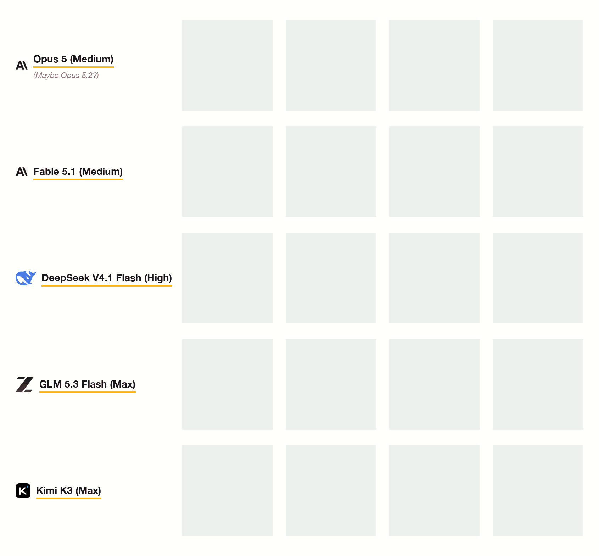

# autoregressive-drawing

A model draws 32×32 pixel art one `#RRGGBB` token at a time, in reading order, with no edits.



- `PROMPTS.md` — the rules and the four subject prompts
- `drawings/<model>/` — the raw grids each model emitted
- `render.py` — upscales a grid to PNG
- `make_gif.py` — animates every grid being drawn

```
python3 render.py drawings/fable/lighthouse.txt
python3 make_gif.py
```
